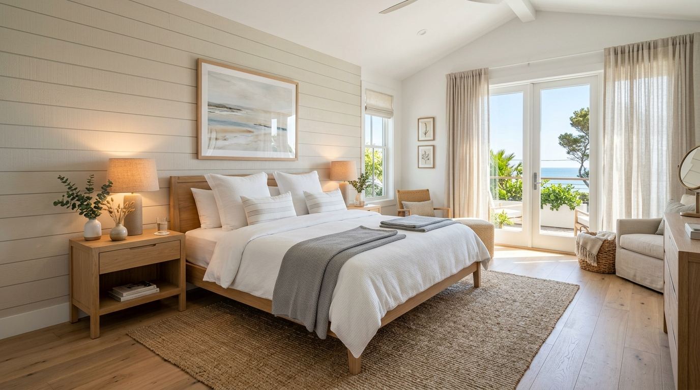

# Pricing Against Traditional Staging

> Frame AI virtual staging not as a cheap compromise, but as a high-ROI velocity engine for real estate agents.

**Track:** AI Real Estate (Virtual Staging)  
**Time:** ~35 minutes  
**Prerequisites:** [01: Empty Room → Staged Room Pipeline](01-empty-room-to-staged-room.md)  

## The Problem

Most creators entering virtual staging fall into a commodity pricing trap: they charge **$5 to $10 per photo** on freelance platforms like Fiverr, competing against low-quality overseas editors who use outdated 3D clip-art.

At the same time, real estate agents and brokers routinely spend **$2,500 to $6,000** for physical furniture staging on a single property. When you pitch AI virtual staging at $10/photo, agents assume the output is cheap, low quality, and unsuitable for high-end MLS listings.

If you don't know how to articulate the economic trade-offs between physical staging, low-end 3D rendering, and photorealistic AI staging, you lose high-ticket clients who have big budgets and recurring listing volume.

---

## The Concept

Winning high-margin virtual staging contracts requires shifting the sales conversation from *cost per image* to **speed, market velocity, and listing ROI**.

```
Physical Staging ($3,500 + 5 Days Wait) ──► AI Virtual Staging ($199 + 24 Hour Turnaround) ──► Agent Savings: $3,301 & 4 Days Faster Listing
```

### The ROI Equation for Real Estate Agents:

$$\text{Listing ROI} = \frac{\text{Perceived Property Value Increase} - \text{Staging Cost}}{\text{Days on Market (DOM)}}$$

1. **Days on Market (DOM) Reduction:** Every extra day a home sits vacant costs the seller/realtor mortgage carrying costs, HOA fees, and property taxes (averaging **$100 to $250/day**). AI virtual staging allows a property to go live on MLS within 24 hours of photography.
2. **Anchor Pricing Strategy:** Never pitch against other $10 freelancers. Anchor your pricing against the **$3,000 physical staging quote**. Offering a full-home 5-room AI staging package for **$199** represents a **93% cost savings** while delivering 95%+ of the visual impact.
3. **High-Margin Add-on Services:**
   * **Virtual Decluttering / Furniture Removal:** Removing old tenant furniture before staging (**+$25/photo**).
   * **Virtual Twilight Conversion:** Converting daytime exterior photos into dramatic sunset dusk shots (**+$30/photo**).
   * **Staging Motion Clips (I2V Video Walkthroughs):** Animating static staged photos into smooth 5-second video clips for Instagram Reels and TikTok listings (**+$40/clip**).

---

## Do It

### Step 1: Benchmark Local Physical Staging Costs
Research physical staging companies in your target city. Note their typical rates:
* **Initial setup fee:** $1,500 – $2,500.
* **Monthly furniture rental:** $1,000 – $2,000/month.
* Use these figures to fill in your sales comparison matrix in [`templates/realtor-pricing-sheet.md`](templates/realtor-pricing-sheet.md).

### Step 2: Establish Productized Tiered Packages
Structure your offers into 3 clear packages to eliminate client hesitation:

```
┌─────────────────────────┐  ┌─────────────────────────┐  ┌─────────────────────────┐
│   Essential Package     │  │    Full House Tier      │  │   Luxury Agency Pass    │
│        $99              │  │        $199             │  │        $399             │
├─────────────────────────┤  ├─────────────────────────┤  ├─────────────────────────┤
│ • 3 Staged Rooms        │  │ • 6 Staged Rooms        │  │ • 8 Staged Rooms        │
│ • 1 Style Revision      │  │ • 2 Style Variations    │  │ • Virtual Decluttering  │
│ • 24h Turnaround        │  │ • Virtual Twilight Shot │  │ • 2 Motion Video Clips  │
│ • High-Res MLS Specs    │  │ • 24h Turnaround        │  │ • Same-Day Turnaround   │
└─────────────────────────┘  └─────────────────────────┘  └─────────────────────────┘
```

### Step 3: Calculate Your Gross Margin & Unit Economics
Calculate your API and production costs per package:
* **Generation Cost (muapi / FLUX):** ~$0.06 per room render × 6 rooms = **$0.36**.
* **Storage & Delivery:** $0.05.
* **Labor / Prompting Time:** 15 minutes = ~$10 labor equivalent.
* **Package Revenue ($199) - Production Cost ($0.41) = $198.59 Gross Profit (99.8% Margin).**

### Step 4: Build the "Staging Comparison Deck"
Create a 1-page visual PDF comparison sheet showing:
* **Left Side:** Physical Staging ($3,500, 5-day setup, 1 static style).
* **Right Side:** Your AI Virtual Staging ($199, 24h delivery, 3 style choices: Modern, Scandinavian, Luxury).

---

## Worked Example

<p align="center">


</p>
<p align="center"><sub>AI Staged Master Bedroom (Left) ──► Image-to-Video Motion Walkthrough (Right) · Video File: <a href="templates/examples/bedroom-staging-motion.mp4">templates/examples/bedroom-staging-motion.mp4</a></sub></p>

**Proposal Breakdown for Century 21 Premier Real Estate**

* **Property Address:** 442 Highland Ave (3-bed, 2-bath vacant home).
* **Quoted Physical Staging:** $3,800 for 1 month rental.
* **Your AI Staging Offer:** Full House Package ($199) + 2 Motion Clips ($80) = **$279 Total**.
* **Outcome:** Agent approved within 2 hours. Delivered 6 staged photos + 2 Reel video clips in 18 hours.
* **Client Result:** Listing went live on Zillow Friday morning, received 4 offers over asking price by Sunday, saving the seller **$3,521** in staging costs.

---

## Compare Tools

| Pricing & Proposal Tools | Primary Function | Setup Time | Best For |
|---|---|---|---|
| **Canva / Google Slides** | Proposal deck & before/after PDF generation | 15 mins | Creating visual pitch decks for local agents |
| **Stripe Invoicing / Wave** | Automated credit card payment collection & recurring billing | 10 mins | Collecting payment upfront before delivering high-res files |
| **Dropbox / Google Drive** | Client proofing and high-res asset delivery | 5 mins | Organizing final MLS-compliant JPEG downloads |

---

## Launch It

**Key rules for contract negotiation:**
* **Require 100% Upfront Payment:** Real estate moves fast; always collect credit card payment via Stripe before releasing unwatermarked high-resolution MLS files.
* **Limit Revision Cycles:** Include **1 free style revision** per photo (e.g., swapping Scandinavian oak for Industrial black metal). Charge **$15 per photo** for subsequent style changes to protect your time.

---

## Exercises

1. **Easy:** Fill out your pricing sheet in [`templates/realtor-pricing-sheet.md`](templates/realtor-pricing-sheet.md) with custom prices tailored to your local real estate market.
2. **Medium:** Calculate the profit margin on a $299 agency package that includes 8 staged photos, 1 virtual twilight conversion, and 2 motion clips.
3. **Hard:** Create a 1-page before/after comparison PDF pitching a luxury realtor on why AI virtual staging is superior to empty listing photos.

---

## Templates

* [`templates/realtor-pricing-sheet.md`](templates/realtor-pricing-sheet.md) — Package structures, margin calculators, and service agreement terms.

---

[← Empty Room → Staged Room Pipeline](01-empty-room-to-staged-room.md) · Next: [Selling to Realtors & Agencies →](03-selling-to-realtors-and-agencies.md)
