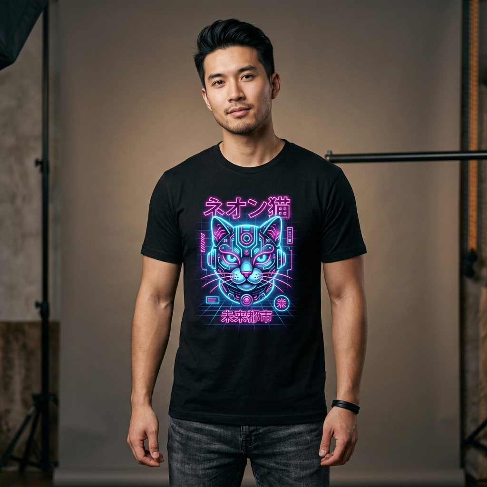

# Designing Sellable AI Art for Merch

> Transform AI art generations into high-resolution, vector-crisp graphics ready for direct-to-garment (DTG) printing.

**Track:** AI Print-on-Demand & Merch Design  
**Time:** ~40 minutes  
**Prerequisites:** None  

## The Problem

Most AI creators try to upload raw AI image generations directly to Print-on-Demand (POD) platforms like Printify, Printful, or Redbubble. The results are disappointing:
* **Resolution Blur:** Raw AI generations (1024x1024px) pixelate heavily when stretched across a t-shirt chest print area requiring **4500x5400px at 300 DPI**.
* **Solid Background Box:** Generating an image with a solid square background leaves an ugly rectangular box printed on a black or white t-shirt.
* **Color Bleed:** Dark or muddy colors wash out during direct-to-garment (DTG) ink printing.

If you don't isolate graphics, vector-upscale, and format specifically for apparel print specs, your products look cheap and get negative customer reviews.

---

## The Concept

The AI merch design pipeline relies on **Isolated Vector Prompting**, **Background Removal**, and **DPI Upscaling**:

```
Isolated Prompting ──► Transparent PNG Isolation ──► Vector Upscale (4500x5400px 300DPI) ──► Apparel Mockup Placement
```

### Core Technical Pillars:

1. **Isolated Vector Style Prompting:** Prompt for clean vector graphics with strong outlines on solid white or dark backgrounds (`"vector illustration, isolated on white background, clean lines, bold graphic, high contrast, 300 DPI"`).
2. **Background Masking & Transparency:** Extracting the subject completely using AI background removers so only the artwork prints on the fabric.
3. **300 DPI Resolution Scaling:** Scaling low-res renders using AI upscalers (such as Real-ESRGAN or muapi high-res upscaling) to hit standard POD specs (**4500 × 5400 px**).

---

## Do It

### Step 1: Write the Merch Vector Prompt
Open [`templates/merch-prompt-brief.md`](templates/merch-prompt-brief.md). Draft an apparel-optimized prompt:
* **Prompt:**  
  > `"Clean vector t-shirt graphic of a cyberpunk samurai cat wearing futuristic glowing neon goggles, Japanese typography, bold outlines, vibrant synthwave colors, isolated on solid black background, high contrast, 8k graphic."`
* **Negative Prompt:**  
  > `"photograph, realistic skin, complex background, gradient box, blurry lines, low resolution, noise, drop shadow."`

### Step 2: Generate and Isolate the Graphic
Run the prompt using muapi `/nano-banana-2`. Pass the generated output to an AI background remover to save a transparent `merch-graphic-transparent.png`.

### Step 3: Upscale to 4500x5400px @ 300 DPI
Run an AI upscaler with a **4x scale factor**. Verify the final image dimensions are at least 4500px wide, maintaining crisp, sharp edges along all linework.

### Step 4: Apply to Apparel Mockups
Place `merch-graphic-transparent.png` onto a heavy cotton t-shirt mockup in your editor. Adjust graphic placement to sit 2 inches below the neck collar.

---

## Worked Example

<p align="center">


</p>
<p align="center"><sub>AI Merch Design Mockup (Left) ──► Image-to-Video Showcase Motion (Right) · Video File: <a href="templates/examples/merch-design-motion.mp4">templates/examples/merch-design-motion.mp4</a></sub></p>

**Merch Design Execution for "Cyberpunk Cat Tee"**

* **Target Niche:** Cyberpunk & Cat Lovers.
* **Graphic Specs:** 4500x5400px transparent PNG, 300 DPI.
* **Apparel Mockup:** Heavyweight Unisex Crewneck T-Shirt (Black).
* **Generation Cost:** **$0.06** AI credit vs **$250** freelance illustrator quote.

---

## Compare Tools

| Platform / Tool | Purpose | Upscale Quality | Best For |
|---|---|---|---|
| **FLUX / muapi Vector Mode** | Graphic generation | High | Creating crisp linework & graphic illustrations |
| **Photoroom / Clipdrop** | Background removal | Transparent PNG | Isolating artwork from solid backgrounds |
| **Real-ESRGAN / Vectorizer.ai** | Resolution upscaling | 4x / Vector SVG | Scaling graphics to 4500x5400px 300DPI |

---

## Launch It

**Best practices for merch design:**
* **Test Dark vs. Light Garments:** Create white linework variants for black tees and dark linework variants for white/heather grey tees.
* **Always Check Contrast:** Print-on-demand ink absorbs slightly into fabric; boost color vibrancy by +15% before exporting.

---

## Exercises

1. **Easy:** Generate a minimalist retro sunset vector graphic isolated on a white background.
2. **Medium:** Remove the background and upscale the graphic to 4500x5400px at 300 DPI.
3. **Hard:** Create a 3-item merch collection (T-shirt, Mug, Tote Bag) featuring variations of a unified design style.

---

## Templates

* [`templates/merch-prompt-brief.md`](templates/merch-prompt-brief.md) — Vector style prompts, DPI scaling specs, and negative prompt libraries.

---

[Track Overview](README.md) · Next: [POD Platform Basics →](02-print-on-demand-platform-basics.md)
